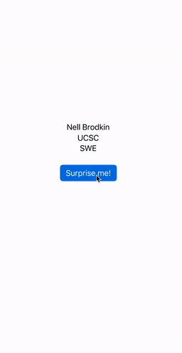

# Prework - *Hello World*

Submitted by: **Nell Brodkin**

**Hello World** is an app with basic functionality.

Time spent: **0.5** hours spent in total

## Required Features

The following **required** functionality is completed:

- [x] Users are see a screen with three labels and a button
- [x] Tapping the button changes the screen color to a random color
 
## Video Walkthrough

GIF created with [Kap](https://getkap.co/).

## App Brainstorming

My favorite applications and some of their features:
- iMessages
  - Searching through all conversations
  - Viewing attachments sent within a message conversation
- Apple Music
  - Collecting songs in playlists
  - Displaying lyrics in real time with the music
- Notes
  - Oranizing notes in folders
  - Draw in notes
 
My own app idea:
- TODO list app
  - Create a list of TODO items
  - Mark tasks as completed
  - Add deadlines, dates, priorities, etc.
  - Color code list items
  - Create seperate lists
  - Move list item deadlines
  - Create a calendar view
    - stretch: sync with calendar

## License

    Copyright 2024 Nell Brodkin

    Licensed under the Apache License, Version 2.0 (the "License");
    you may not use this file except in compliance with the License.
    You may obtain a copy of the License at

        http://www.apache.org/licenses/LICENSE-2.0

    Unless required by applicable law or agreed to in writing, software
    distributed under the License is distributed on an "AS IS" BASIS,
    WITHOUT WARRANTIES OR CONDITIONS OF ANY KIND, either express or implied.
    See the License for the specific language governing permissions and
    limitations under the License.
